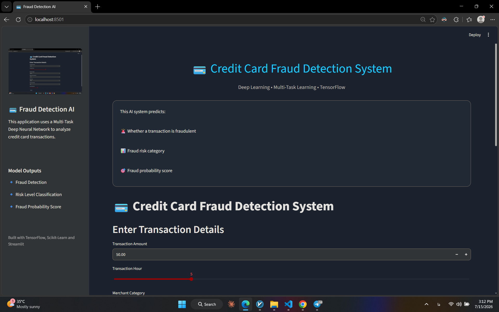
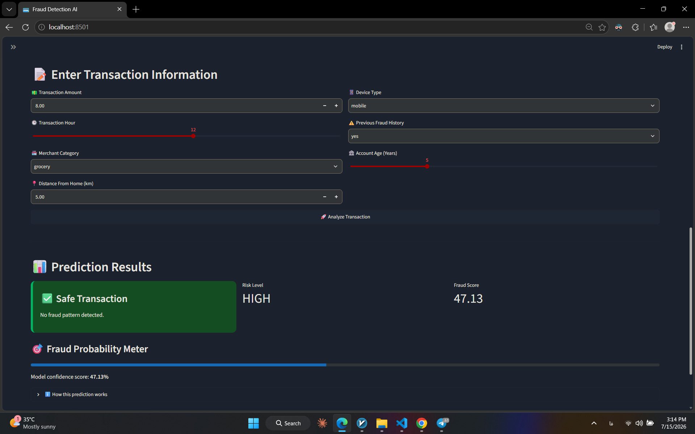

# 💳 Credit Card Fraud Detection using Multi-Task Deep Learning


---

## 📌 Project Overview

This project demonstrates an end-to-end **Credit Card Fraud Detection System** powered by **Multi-Task Learning** using TensorFlow/Keras.

Instead of solving only one problem, the neural network simultaneously learns to:

- ✅ Detect whether a transaction is fraudulent.
- ✅ Predict the fraud risk level.
- ✅ Estimate a continuous fraud probability score.

The project also includes:

- Complete preprocessing pipeline
- Missing value handling
- Outlier treatment
- Feature engineering
- Streamlit Web Application
- Saved preprocessing pipeline for deployment

---

# 🚀 Streamlit Demo

The web application interface looks like this:

<p align="center">
  
</p>

---

<p align="center">
  
</p>

---

# 🧠 Multi-Task Learning Architecture

The model contains three parallel branches.

<p align="center">

</p>

---

# ✨ Features

- Multi-Task Deep Learning
- Binary Classification
- Multi-Class Classification
- Regression Prediction
- Missing Value Imputation
- One-Hot Encoding
- Feature Scaling
- Outlier Handling (IQR)
- TensorFlow Functional API
- EarlyStopping
- ReduceLROnPlateau
- Streamlit Deployment
- Model Serialization
- Preprocessing Pipeline Saving

---

# 📂 Project Structure

```text
Credit Card Fraud Detection/
│
├── app/
│   └── streamlit_app.py
│
├── model/
│   ├── fraud_ann_model.keras
│   ├── preprocessor.pkl
│   └── risk_encoder.pkl
│
├── notebooks/
│   └── training.ipynb
│
├── images/
│   ├── Streamlit_Home.png
│   ├── Streamlit_Result.png
│   └── ModelArchitecture.png
│
├── requirements.txt
├── README.md
└── .gitignore
```

# 📊 Dataset

A synthetic dataset was generated containing realistic banking transaction information.

### Numerical Features

- Transaction Amount
- Transaction Hour
- Distance From Home
- Account Age

### Categorical Features

- Merchant Category
- Device Type
- Previous Fraud Flag

### Model Targets

| Task | Output |
|------|---------|
| Binary Classification | Fraud Label |
| Multi-Class Classification | Fraud Risk Level |
| Regression | Fraud Probability Score |

---

# ⚙ Data Preprocessing

The preprocessing pipeline includes:

- Median Imputation
- Most Frequent Imputation
- Standard Scaling
- One-Hot Encoding
- IQR Outlier Treatment
- Label Encoding

Implemented using **Scikit-Learn Pipeline** and **ColumnTransformer**.

---

# 🏗 Model Architecture

The project uses TensorFlow Functional API.

Architecture Summary:

- Input Layer
- Three Independent Dense Branches
- Feature Concatenation
- Shared Dense Layers
- Three Output Heads

### Output Heads

### 1️⃣ Fraud Detection

Binary Classification

Activation:

```
Sigmoid
```

Loss:

```
Binary Crossentropy
```

---

### 2️⃣ Fraud Risk Level

Multi-Class Classification

Activation:

```
Softmax
```

Loss:

```
Sparse Categorical Crossentropy
```

---

### 3️⃣ Fraud Probability Score

Regression

Activation:

```
Linear
```

Loss:

```
Mean Squared Error (MSE)
```

---

# 📈 Training

The model was trained using:

- Adam Optimizer
- EarlyStopping
- ReduceLROnPlateau
- Validation Split = 20%
- Batch Size = 32
- Epochs = 20

---

# 📊 Evaluation

Binary classification performance is evaluated using:

- Accuracy
- Classification Report
- Confusion Matrix

---

# 🛠 Technologies Used

- Python
- TensorFlow / Keras
- Scikit-Learn
- Pandas
- NumPy
- Joblib
- Streamlit

---

# 🚀 Installation

Clone the repository

```bash
git clone https://github.com/Amirali-Ghasemi/Credit-Card-Fraud-Detection.git
```

Go into the project

```bash
cd Credit-Card-Fraud-Detection
```

Install dependencies

```bash
pip install -r requirements.txt
```

---

# ▶ Run the Streamlit App

```bash
streamlit run app/streamlit_app.py
```

---

# 💾 Saved Files

After training, the following artifacts are saved:

```
fraud_ann_model.keras
preprocessor.pkl
risk_encoder.pkl
```

These files are directly loaded by the Streamlit application.

---

# 🎯 Future Improvements

- Train on real-world fraud datasets
- Hyperparameter Optimization
- Explainable AI (SHAP/LIME)
- Model Quantization
- Docker Deployment
- Cloud Deployment
- REST API with FastAPI
- Model Monitoring

---

# 👨‍💻 Author

**Amirali**

Computer Engineering Student

Machine Learning & Deep Learning Enthusiast

